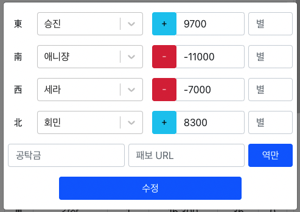
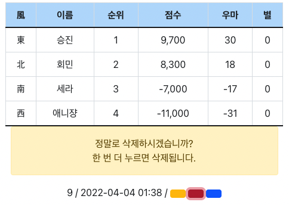

# 마작 기록 사이트

## 기술스택
- Docker
- Node.js@16.14.1 / Typescript
- MySQL@5.7
- Git
- Markdown
- React

 

## 홈페이지
[http://shrimp2ubt.ddns.net/](http://shrimp2ubt.ddns.net/)

 

## 사진
### 순위 ( Ranking )
 

### 최근 기록 ( Recent )

### 관리자 로그인

### 관리자 로그인시 나타나는 버튼

노란색 버튼
- 기록 수정

빨간색 버튼
- 기록 삭제

파란색 버튼
- 기록 삭제 취소

### 기록 입력

